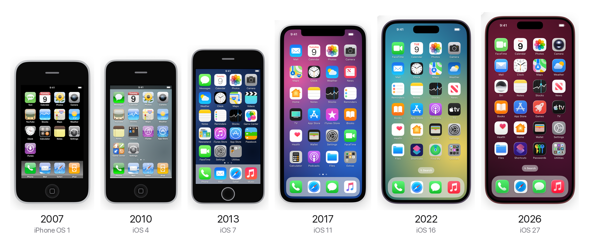
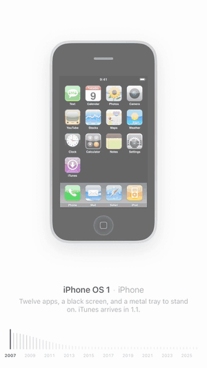
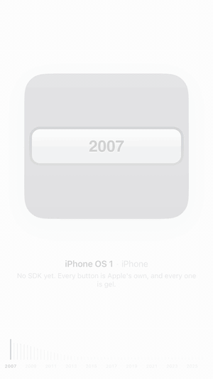
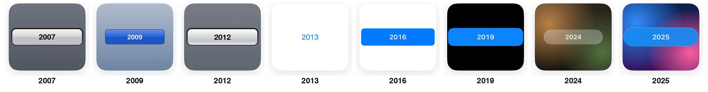

<p align="center">
  
</p>

<h1 align="center">iOS Eras</h1>

<p align="center">
  Drag a ruler from 2007 to 2026 and watch the iPhone rebuild itself.<br />
  Every home screen, every dock, every notch, and one very patient button.
</p>

<p align="center">
  <a href="https://haplollc.github.io/ios-eras/"></a>
</p>

<p align="center">
  
  
  
  
</p>

---

<table>
<tr>
<td width="50%" align="center">
  <br />
  <strong>The home screen</strong><br />
  <sub><a href="media/home-screen-eras.mp4">full video</a></sub>
</td>
<td width="50%" align="center">
  <br />
  <strong>The button</strong><br />
  <sub><a href="media/button-eras.mp4">full video</a></sub>
</td>
</tr>
</table>

## The home screen

Every stock Apple app appears in the release it shipped in and leaves when
Apple took it away: YouTube in iOS 6, Newsstand in iOS 9, Game Center in
iOS 10. Every icon is redrawn at every version Apple redrew it. The phone
changes around it as you drag: the metal dock tray becomes a glass shelf, then
a frosted strip, then a floating dock. The home button gives way to the notch,
and the notch pulls in and drops off the edge to become the Dynamic Island.

## The button

One push button, from the gel of iPhone OS 1 to the Liquid Glass of iOS 26 and
27, drawn large on a swatch of that year's screen.

<p align="center">
  
</p>

## Twenty years, one ruler

| Year | Release | iPhone | What changed |
| --- | --- | --- | --- |
| 2007 | iPhone OS 1 | iPhone | Twelve apps, a black screen, and a metal tray to stand on. iTunes arrives in 1.1. |
| 2008 | iPhone OS 2 | iPhone 3G | The App Store arrives. Contacts gets its own icon, on page two. |
| 2009 | iPhone OS 3 | iPhone 3GS | Text becomes Messages. Voice Memos and Compass fill the page. |
| 2010 | iOS 4 | iPhone 4 | Wallpaper at last. Folders arrive, and Utilities swallows the small apps. Game Center. |
| 2011 | iOS 5 | iPhone 4S | iPod splits into Music and Videos. Reminders and Newsstand move in. |
| 2012 | iOS 6 | iPhone 5 | A fifth row. YouTube is gone, Passbook is in, and Maps is Apple's own. |
| 2013 | iOS 7 | iPhone 5s | Everything flattens and every icon is redrawn. FaceTime gets its own icon. |
| 2014 | iOS 8 | iPhone 6 | A bigger phone, a sixth row. Health, iBooks, Podcasts and Tips come built in. |
| 2015 | iOS 9 | iPhone 6s | San Francisco. News replaces Newsstand, Passbook becomes Wallet. Find iPhone and Watch. |
| 2016 | iOS 10 | iPhone 7 | Messages takes Mail's place in the dock. Home arrives, Game Center goes. |
| 2017 | iOS 11 | iPhone X | The notch. The dock floats. Files arrives; App Store and Camera get new faces. |
| 2018 | iOS 12 | iPhone XS | FaceTime takes the top corner. Measure arrives; iBooks is just Books. |
| 2019 | iOS 13 | iPhone 11 Pro | Dark Mode. Find My merges two apps; Shortcuts comes built in. |
| 2020 | iOS 14 | iPhone 12 Pro | Widgets and the App Library arrive. Translate and Magnifier. |
| 2021 | iOS 15 | iPhone 13 Pro | A smaller notch. Camera rounds off, Maps drops its highway shield. |
| 2022 | iOS 16 | iPhone 14 Pro | The Dynamic Island. A Search pill replaces the dots. Freeform and Fitness. |
| 2023 | iOS 17 | iPhone 15 Pro | Same page, new phone. Journal arrives. |
| 2024 | iOS 18 | iPhone 16 Pro | Passwords gets its own app. Icons can go anywhere, dark or tinted. |
| 2025 | iOS 26 | iPhone 17 Pro | Liquid Glass: every icon is layered light. Games takes Podcasts' slot; Preview. |
| 2026 | iOS 27 | iPhone 18 Pro | Siri gets an icon of its own and Reminders leaves the page. Sharper glass. |

## How it's made

- **Measured, not eyeballed.** Every position on the home screen (grid
  columns and rows, icon and label sizes, dock height and insets, page dots,
  the Search pill, the status bar) was measured off a real screenshot of that
  version, then checked against our render until it sat within about 3 pt.
- **Everything is a number, so everything morphs.** Each year is a table of
  numbers and colours. Between two years they blend: icons slide to their new
  slots, arrivals grow in, departures shrink away, and the bezels, corners and
  the dock ease from one phone to the next.
- **One shape for the notch and the island.** In 2021→2022 the notch loses its
  shoulders, draws in to the island's size, then drops away from the edge and
  rounds off.
- **Drawn, not copied.** Every icon is built from basic shapes, redrawn for
  each era. No Apple artwork, images or fonts are included.

## Run it

**In the browser.** No install needed: [haplollc.github.io/ios-eras](https://haplollc.github.io/ios-eras/). To run it locally:

```sh
cd web
npm install
npm run dev
```

| Query | Does |
| --- | --- |
| `?page=button` | The button instead of the home screen |
| `?year=2013` | Open on a year |
| `?pos=14.5` | Open halfway between two years, to see a morph |
| `?demo=1` | Play the scripted walk from the videos |
| `?gallery=Settings` | One app's icon at every year |

**On iPhone.** Open `ios/iOSEras.xcodeproj` in Xcode 26 and run it on an
iPhone or the simulator (iOS 26+). Drag the ruler at the bottom of either page.

## Inside

| Path | What |
| --- | --- |
| [`web/`](web) | The browser version: Vite + TypeScript, no framework, icons as SVG |
| [`ios/`](ios) | The SwiftUI original |
| [`scripts/`](scripts) | How the videos were made: a scripted walk, a frameless render, synthesized ruler clicks |
| [`media/`](media) | The videos and images above |

---

<p align="center">
  <sub>
    Not affiliated with or endorsed by Apple Inc. Apple, iPhone and iOS are trademarks of Apple Inc.<br />
    The icons and interface are hand-drawn recreations for design-history commentary.
    See <a href="THIRD_PARTY_NOTICES.md">third-party notices</a>.
  </sub>
</p>

<p align="center">
  Made by <a href="https://x.com/jc_builds">@jc_builds</a> at <a href="https://github.com/haplollc">Haplo</a> · MIT licensed
</p>
